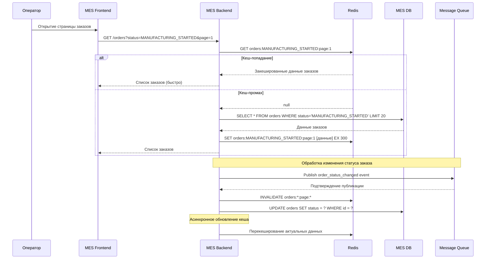

### Мотивация

В текущей архитектуре системы MES существует несколько проблем производительности:
- Медленная загрузка страницы со списком заказов (2-3 минуты, в сложных случаях до 30 минут)
- Высокая нагрузка на систему при расчете стоимости изделий
- Рост количества заказов (линейный рост +100 заказов ежемесячно)

Кеширование позволит решить следующие проблемы:
- Ускорить доступ к часто запрашиваемым данным
- Снизить нагрузку на базу данных
- Улучшить отзывчивость пользовательского интерфейса

Элементы системы для кеширования

| Компонент | Тип данных | Цель кеширования |
|-|-|-|
| MES API | Результаты расчета стоимости изделий | Ускорение повторных расчетов |
| MES DB | Списки заказов по статусам | Быстрый доступ к актуальным заказам |
| 3D File Storage | Метаданные 3D-моделей | Снижение нагрузки на файловое хранилище |

### Предлагаемое решение

Тип кеширования: Серверное кеширование

Выбор серверного кеширования обоснован следующими причинами:
- Централизованное управление кешем
- Единый источник кешированных данных для всех клиентов
- Возможность тонкой настройки политик кеширования

Паттерн кеширования: Cache-Aside

Причины выбора:
- Простота реализации
- Гибкость в управлении кешем
- Возможность постепенной миграции

Сравнение паттернов:

| Паттерн | Преимущества | Недостатки |
|-|-|-|
| Cache-Aside | - Простота реализации - Гибкость - Низкая связанность | - Возможные промежуточные состояния - Дополнительная логика в коде |
| Write-Through | - Консистентность данных - Автоматическое обновление | - Overhead при записи - Сложная реализация |
| Refresh-Ahead | - Проактивное обновление - Меньше задержек | - Сложное прогнозирование - Высокие накладные расходы |

### Стратегия инвалидации кеша

| Стратегия | Преимущества | Недостатки |
|--|--|--|
| Временная | - Простота реализации - Автоматическое обновление | - Возможное отображение устаревших данных |
| По ключу | - Точечное обновление - Гибкость | - Сложность реализации - Необходимость явного управления |
| Программная | - Полный контроль - Гибкость | - Высокая сложность реализации |

Выбрана комбинированная стратегия:
- Временная инвалидация (TTL)
- Программная инвалидация по ключевым событиям

Причины выбора:
- Автоматическое устаревание данных
- Возможность принудительного обновления
- Гибкость настройки для разных типов данных

Параметры инвалидации:
- Расчеты стоимости: TTL 24 часа
- Списки заказов: TTL 1 час
- Принудительная инвалидация при изменении статуса заказа

Технические детали реализации

1. Использовать распределенный кеш Redis
2. Внедрить абстракцию кеширования в MES API
3. Добавить механизмы логирования и мониторинга кеша
4. Реализовать постепенную миграцию с fallback на прямое обращение к БД

Риски и ограничения

- Возможное увеличение сложности кода
- Необходимость дополнительного обучения команды
- Начальные трудозатраты на внедрение

Следующие шаги

1. Прототипирование
2. Нагрузочное тестирование
3. Поэтапное внедрение
4. Мониторинг производительности
